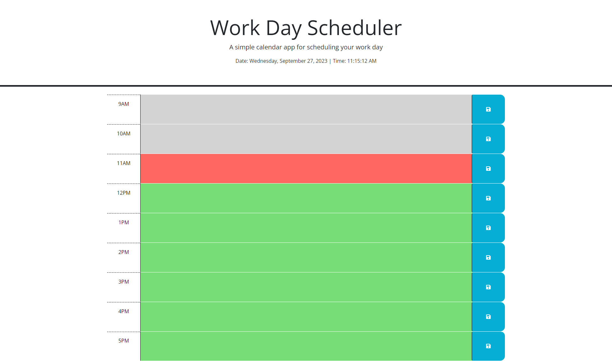
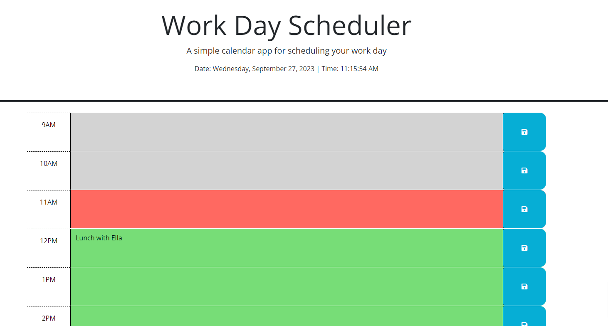

# WorkDay-Scheduler

## Description

Starter code provided for a workday scheduler. Objective was to get the schedule block times to color code based on time of day. App should display current date and time, and will color code based on whether we are past current hour, in current hour, and future hours. I struggled a bit with getting the save button to store items in local storage. 

## Usage

User will be presented with schedule app featuring times from 9am to 5pm. Past times will appear in gray, present time will be red, future time slots will be green.

User can click time slot and type in schedule item, and save by clicking the save button.

Once the user clicks the save button, the schedule entry will remain on the time block even upon refresh.

## Credits

<ul>
    <li><a href="https://github.com/coding-boot-camp/crispy-octo-meme">Starter Code</a></li>
    <li><a href="https://www.coderscampus.com/complete-beginners-guide-jquery/">Beginner's Guide to jQuery</a></li>
    <li><a href="https://zoom.us/rec/play/2Rx_NlbwJu8CtdRqkn2uBwOSUgtOxFnYdoqife6dH7dZhAk8cu_16VOs38KOFTdWFdFofNUS3EgMSu8.bNHvk7CMFrBrP_cm">Class recording after hours: Third Party APIs day 3</a></li>
    <li><a href="https://www.w3schools.com/js/js_api_web_storage.asp">Web Storage API</a></li>
    
